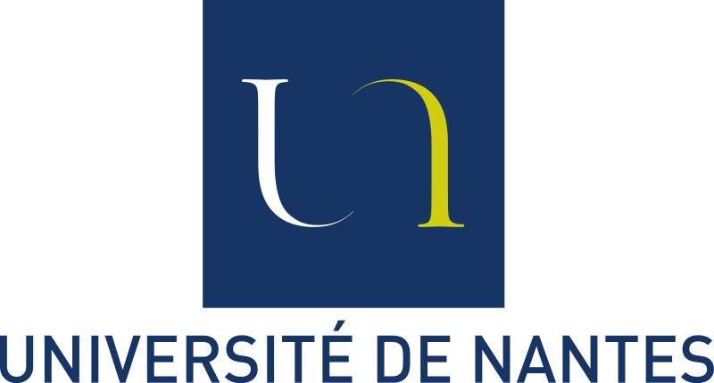
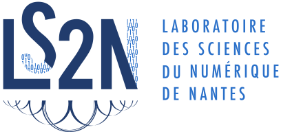

---
# Feel free to add content and custom Front Matter to this file.
# To modify the layout, see https://jekyllrb.com/docs/themes/#overriding-theme-defaults

layout: home
---

# The DELICES project

<em>Indexing Scientific Literature Through Semantic Expansion</em>

**DELICES** is a *Young Researcher* project funded by the French National
Research Agency ([ANR-19-CE38-0005](https://anr.fr/Projet-ANR-19-CE38-0005)) that started in January 2020 and will end in July 2024.
This project is intended to improve and enrich paper indexing in scientific digital libraries.

## Overview

Scientific digital libraries (e.g. arXiv, ACM Digital Library) play a critical role in the development and dissemination of scientific literature.
They provide researchers with access to millions of scientific articles, as well as an effective way to communicate their findings.
Despite dedicated search engines, retrieving relevant publications from the ever-growing body of scientific literature remains challenging and time-consuming.
Indexing scientific articles is indeed a difficult matter, and current models typically relies on a small fraction of the papers content (title and abstract) and on author-assigned keyphrases when available.
This results in a frustratingly limited access to scientific knowledge.
The goal of the DELICES project is to address this pitfall by exploiting semantic relations between scientific articles to both improve and enrich indexing.

    <footer class="site-footer">
          
          
          
    </footer>

